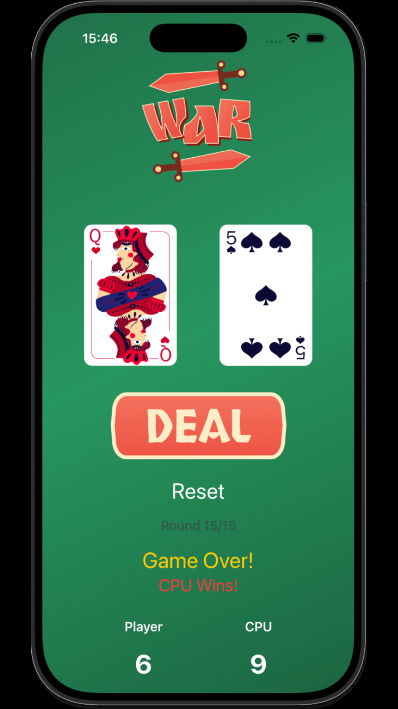
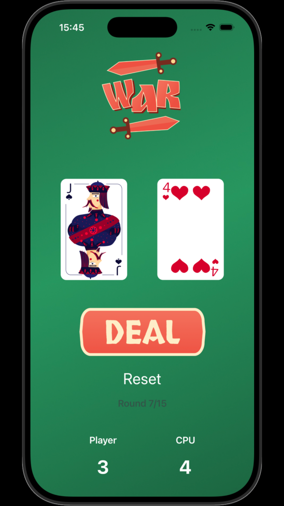
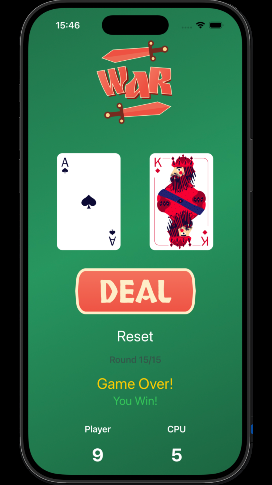

# Card Combat

A simple card game built with SwiftUI.  
The player and CPU each draw a random card — the highest card wins the round.  
The game lasts for 15 rounds, after which the winner is announced.

---

## Features
- Player vs CPU card draw
- Randomized cards from deck (2–14)
- Score tracking for both player and CPU
- 15 rounds per game
- "Game Over" screen with result message:
  - *You Win!*  
  - *CPU Wins!*  
  - *It's a Tie!*
- Reset button to start a new game at any time
- Smooth animations when cards change
- Round indicator showing current round out of 15
- Clean and simple UI with SwiftUI layout

---

## Getting Started

### Requirements
- Xcode 15 or later
- iOS 17 or later

### Installation
1. Clone the repository using:
   git clone https://github.com/yourusername/CardCombat.git
2. Open `CardCombat.xcodeproj` in Xcode.
3. Run the project on simulator or device.

---

## How to Play
1. Press the **Deal** button to draw cards for both player and CPU.
2. The higher card wins the round, and the score is updated automatically.
3. Continue playing until 15 rounds are completed.
4. When the game ends, the **Game Over** message will show the winner.
5. Press **Reset** at any time to start a new game.

---

## Screenshots

| Screenshot 1 | Screenshot 2 |
|--------------|--------------|
|  |  |

| Screenshot 3 | Screenshot 4 |
|--------------|--------------|
|  |  |

---

## Future Improvements
- Add sound effects for dealing cards and winning rounds
- Add custom card deck designs
- Add a progress bar or animations to show game progression
- Include multiplayer support (local or online)
- Add difficulty levels for CPU

---

## Contact Information

- [Email](mailto:elenakoni99@gmail.com)  
- [LinkedIn](https://www.linkedin.com/in/elena-konsoula/)  
- [Personal Website](https://elena-konsoula.lovestoblog.com/?i=1)

## License
Copyright (c) Elena Konsoula 2025 This package is provided under the MIT License. 

