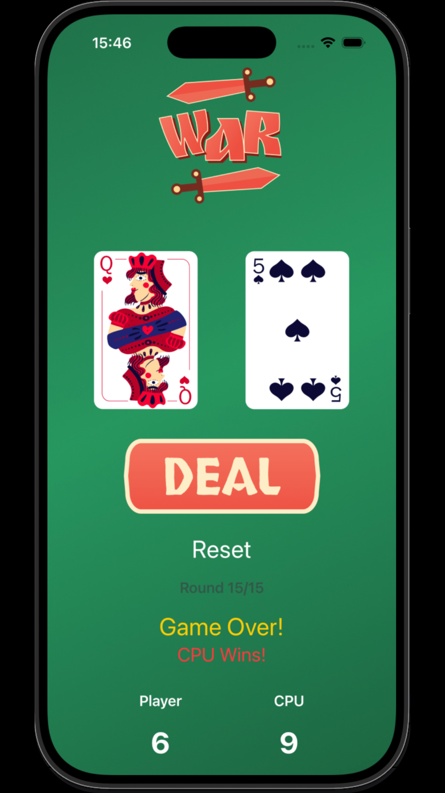
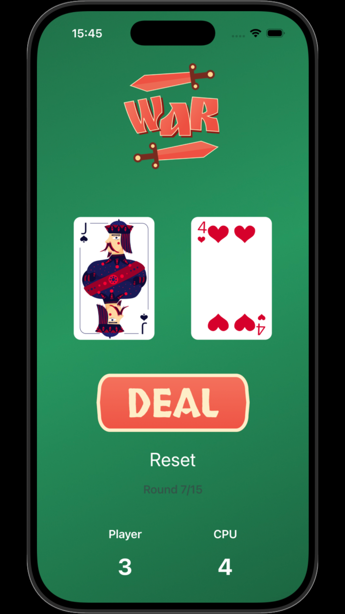
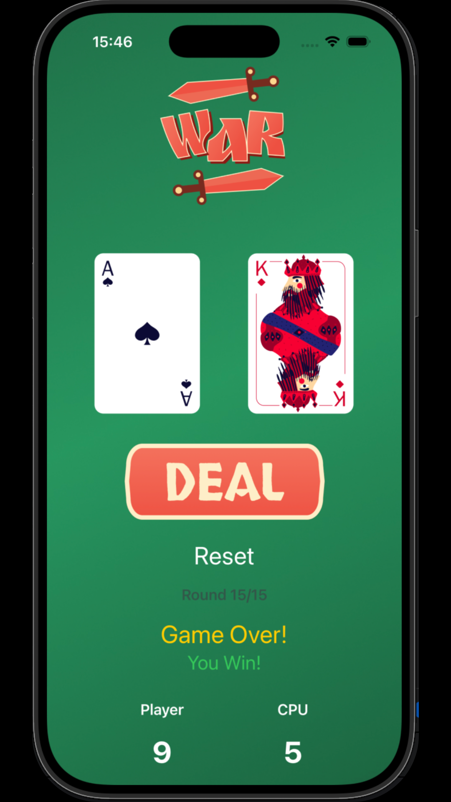

# Card Combat

---

## Description

Card Combat is a simple and fun card game built with SwiftUI. The player competes against the CPU in 15 rounds, drawing random cards from a deck — the highest card wins each round. The game features a clean interface, smooth animations, and real-time score tracking for an engaging experience.

---

## Technologies Used
- SwiftUI – for building the user interface
- Xcode – development and testing environment

---

## Future Improvements
- Add sound effects and background music
- Custom card deck themes
- Multiplayer (local or online) mode
- Progress bar or round animations
- Difficulty levels for CPU

---

## Screenshots

| Screenshot 1 | Screenshot 2 |
|--------------|--------------|
|  |  |

| Screenshot 3 | Screenshot 4 |
|--------------|--------------|
|  |  |

---

## Getting Started

### Requirements
- Xcode 15 or later
- iOS 17 or later

### Installation
1. Clone the repository using:
   git clone https://github.com/yourusername/CardCombat.git
2. Open `CardCombat.xcodeproj` in Xcode.
3. Run the project on simulator or device.

---

## Contact Information
For inquiries, collaborations, or feedback, you can reach me at: 
- [Email](mailto:elenakoni99@gmail.com)  
- [LinkedIn](https://www.linkedin.com/in/elena-konsoula/)  
- [Personal Website](https://elena-konsoula.lovestoblog.com/?i=1)
